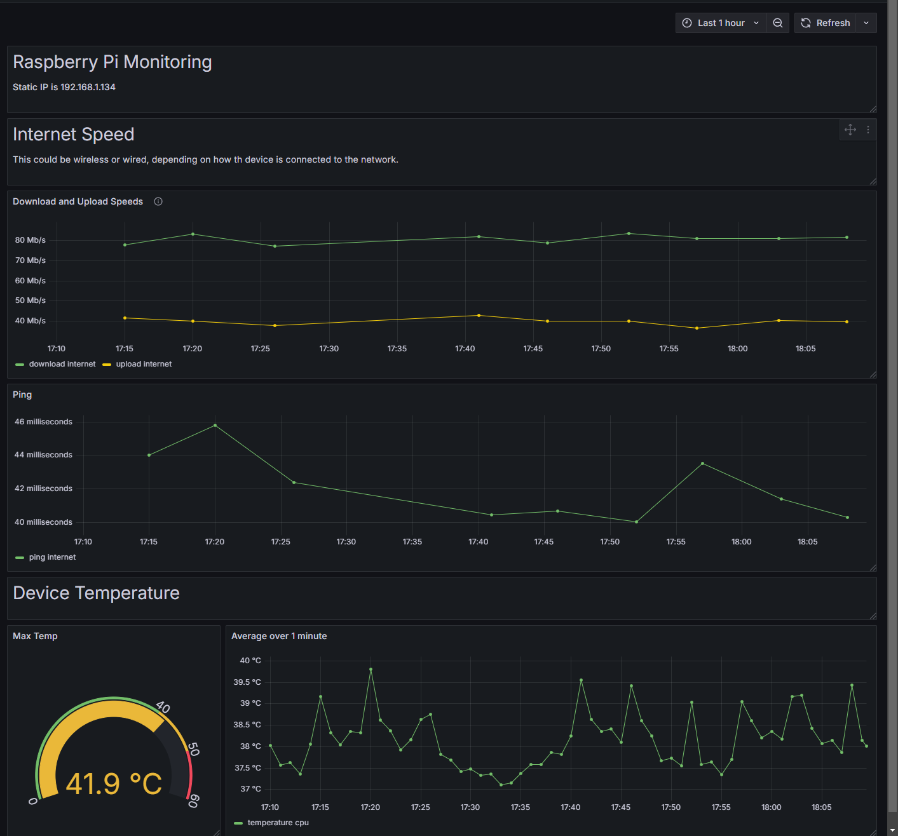

### Grafana Provisioning
#### InfluxDB Data Source
I automated the Grafana InfluxDB data source. It is using the Flux query language. I'm not a big fan of that query language but the original project was using it so I just went along with it.

#### Dashboards
I have the dashboard in source control but I noticed that it references a data source ID. The problem is that this ID will change for fresh installs. The easiest solution is to just get the InfluxDB data source id, and then do a find and replace within the dashboard json file. It's annoying, but only takes a few seconds to do. Then import the updated JSON file into the GUI.

### Docker Service Management
```bash
docker compose build  # build images
docker compose up     # start containers (use -d to detatch from the terminal)
docker compose down   # stop containers (you can just control-c if still attached)
```

### Included Grafana Dashboard
